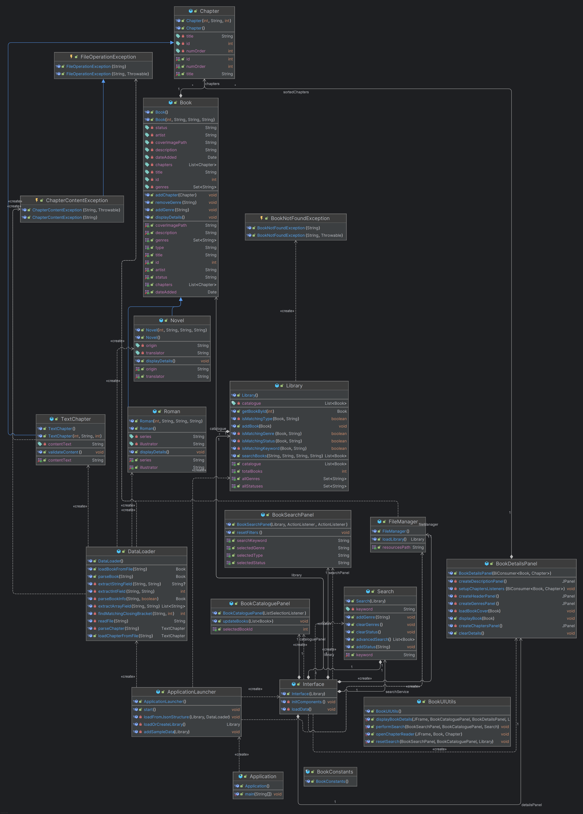

# 📚 Chapitre et Cassoulet

Welcome to the **Chapitre et Cassoulet** project! This project is a library management system that allows users to manage a collection of books, including novels, manga, and romans. The system provides functionalities for searching, filtering, and displaying book details.

## 🚀 Features

- **Search and Filter**: Search books by title, genre, status, and type.
- **Book Details**: View detailed information about each book, including cover image, description, genres, and chapters.
- **Catalogue Management**: Add, update, and remove books from the catalogue.
- **Chapter Management**: Manage chapters within each book, including viewing and editing chapter content.

## 🛠️ Installation

1. **Install Java Development Kit (JDK 23 or later)**:
   - Download and install JDK 23 or later from the [Oracle website](https://www.oracle.com/java/technologies/downloads/).
   - This application requires JDK 23 or a newer version to run properly.
   
   
2. **Clone the repository**:
    ```sh
    git clone https://github.com/zoom26042604/Chapitre-et-Cassoulet.git
    cd Chapitre-et-Cassoulet/src
    ```

3. **Run the application (May not work be careful)**:
    ```sh
    java main/java/fr/ynov/chapitre_et_cassoulet/Application.java
    ```
   
4. **Or you can run the application by building the Application.java class**:

## 📂 Project Structure

- `src/main/java/fr/ynov/chapitre_et_cassoulet/`: Main source code directory.
- `src/resources/data/`: Directory containing sample data for books and chapters.
- `src/main/java/fr/ynov/chapitre_et_cassoulet/gui/`: GUI components for the application.
- `src/main/java/fr/ynov/chapitre_et_cassoulet/model/`: Data models representing books and chapters.
- `src/main/java/fr/ynov/chapitre_et_cassoulet/service/`: Service classes for managing library operations.
- `src/main/java/fr/ynov/chapitre_et_cassoulet/exception/`: Custom exceptions used in the application.
- `src/main/java/fr/ynov/chapitre_et_cassoulet/utils/`: Utility classes and constants.

## 📊 Class Diagram

Below is the class diagram representing the architecture of the Chapitre et Cassoulet application:



## 📖 Usage

### Search Panel

The `BookSearchPanel` allows users to search for books by title, genre, status, and type. Users can enter a keyword, select filters, and click the **Search** button to find matching books. The **Reset** button clears all filters.

### Book Details Panel

The `BookDetailsPanel` displays detailed information about a selected book, including the cover image, title, author, type, status, description, genres, and chapters. Users can double-click on a chapter to view its content.

### Book Catalogue Panel

The `BookCataloguePanel` shows a table of all books in the library. Users can select a book to view its details in the `BookDetailsPanel`.

## 👥 Contributors
[](https://github.com/zoom26042604) 
- **[Nathan FERRE](https://github.com/zoom26042604)**


### 📋 Book List

Below is a list of books currently available in the Chapitre et Cassoulet library:

#### Novels
| ID | Title                 | Status    | Origin | Translator           |
|----|-----------------------|-----------|--------|----------------------|
| 1  | Shadow Slave          | Ongoing   | Russia | Anonymous            |
| 2  | Lord of the Mysteries | Completed | China  | Qidian International |

#### Romans (Comic Books)
| ID | Title                               | Status    | Series       | Illustrator   |
|----|-------------------------------------|-----------|--------------|---------------|
| 3  | Harry Potter to the Wizardly School | Completed | Harry Potter | Mary GrandPré |